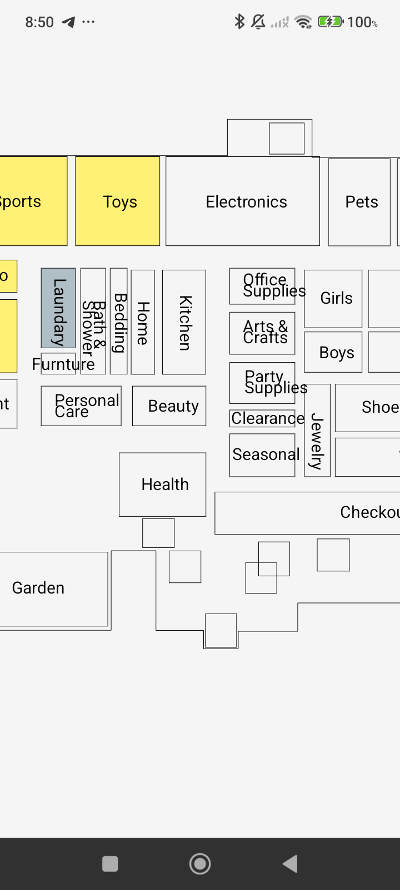
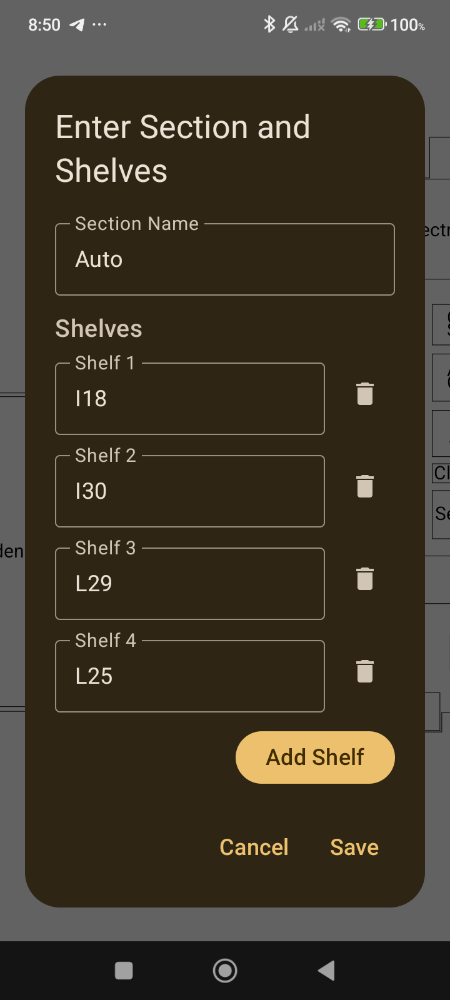
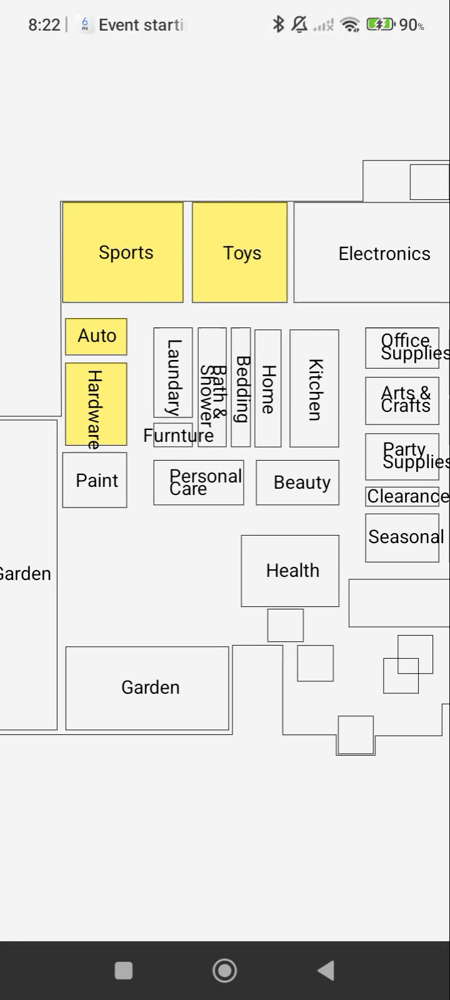

# 🗺️ Walmart Store Shelf Tracker App

An Android application developed to help associates at Walmart Store #988 efficiently track and locate stocked shelves using a visual map interface.

## 📱 About the App

This app was designed with real-world store operations in mind. It displays an interactive map of the store layout, allowing users to view which shelves have been stocked. The goal is to improve restocking efficiency, reduce search time, and enhance overall inventory visibility.

### 🛠️ Key Features

- 📍 Visual store map with labeled shelves  
- ✅ Real-time shelf stock status  
- 🔎 Tap-to-view shelf information  
- 🧩 Custom path visualization (for large stores)  
- 🖼️ Zoom and pan gesture support  

## 📸 Screenshots

| Store Map View | Shelf Info Dialog | Zoom & Pan |
|----------------|-------------------|-------------|
|  |  |  |

## 🎥 Demo Video

> 📂 Video File: [`demo.mp4`](./demo.mp4)

To view the demo:
1. Download or clone this repository.
2. Open the `demo.mp4` file in any media player.

> GitHub does not support embedded video playback from local files, so direct video playback in the README is not possible. However, you can watch the clip manually from the file.

## 🚀 Technologies Used

- **Kotlin** for Android development  
- **Jetpack Compose** for modern UI  
- **Canvas** for custom map rendering  
- **Room Database** for local shelf data management  

## 📦 Future Improvements

- 🔄 Sync with store backend systems  
- 📤 Upload restock logs  
- 👥 Multi-user support  

## 🙋‍♂️ About the Developer

Hi, I'm **Lishan Geleta**, an Android app developer currently working at Walmart Store #988. I created this app to solve a local challenge and demonstrate how software can improve real-world retail operations.

If you're interested in collaborating or learning more, feel free to reach out!
